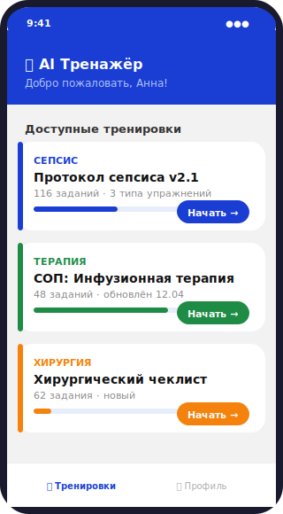
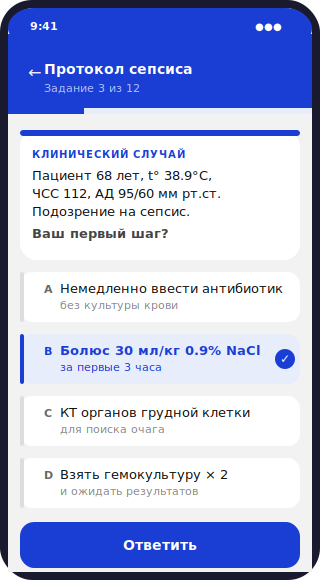
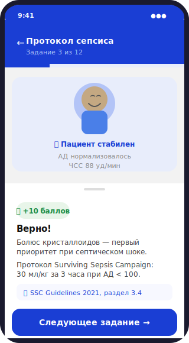
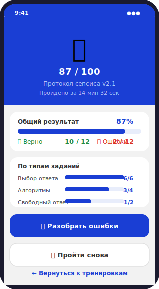
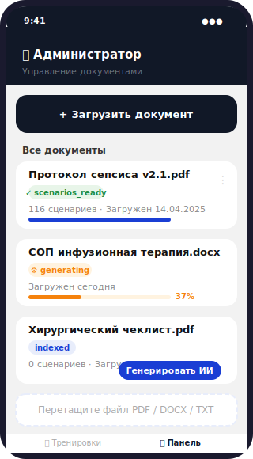

<div align="center">

<br/>



# МИР - Медицинский инетрактивный репетитор

**Загружаете СОП или клинический протокол — получаете готовый интерактивный тренажёр за минуты**

Нативный Telegram MiniApp · Три типа заданий · ИИ-оценка · Полностью бесплатный стек

<br/>

[](https://python.org)
[](https://fastapi.tiangolo.com)
[](https://react.dev)
[](https://langchain-ai.github.io/langgraph)
[](https://console.groq.com)
[](https://github.com/pgvector/pgvector)
[](LICENSE)

</div>

<br/>

---

## Интерфейс

<div align="center">

<table>
<tr>
<td align="center" width="25%">
<br/>
<sub><b>Каталог тренировок</b></sub>
</td>
<td align="center" width="25%">
<br/>
<sub><b>Выбор ответа</b></sub>
</td>
<td align="center" width="25%">
<br/>
<sub><b>Разбор с пояснением</b></sub>
</td>
<td align="center" width="25%">
<br/>
<sub><b>Итоги тренировки</b></sub>
</td>
</tr>
</table>

<br/>


<br/>
<sub><b>Панель администратора</b></sub>

</div>

---

## Как это работает

```
  📄 Загружаете PDF / DOCX / TXT (до 50 МБ, есть OCR)
        │
        ▼
  🤖 LangGraph pipeline: extract → clean → chunk → embed → persist
        │
        ▼
  ⚡ Groq llama-3.1-8b генерирует сценарии трёх типов
        │
        ▼
  📱 Медперсонал проходит тренинг прямо в Telegram
        │
        ▼
  📊 ИИ оценивает свободные ответы и даёт обратную связь
```

**Три типа заданий:**

| Тип | Описание | Как проверяется |
|-----|----------|-----------------|
| 🎯 Выбор ответа | Клинический сценарий + 4 варианта | Dict lookup, < 200 мс, без LLM |
| 🔀 Алгоритм | Drag-and-drop порядок шагов | LLM только для первой ошибки |
| ✍️ Свободный текст | Открытый ответ по теме | Groq оценивает по 3 критериям (0–3 балла) |

---

## Стек

| Слой | Технология |
|------|-----------|
| **Frontend** | React 18 · TypeScript · Tailwind CSS · @dnd-kit |
| **Backend** | Python 3.11 · FastAPI · SQLAlchemy 2 async |
| **AI Pipeline** | LangGraph 0.2 · LangChain 0.3 |
| **LLM** | Groq `llama-3.1-8b-instant` (бесплатный tier) |
| **Embeddings** | `intfloat/multilingual-e5-small` — локально, без API |
| **Database** | PostgreSQL 16 + pgvector · Redis 7 |
| **Auth** | Telegram initData HMAC-SHA256 + JWT |
| **Parsing** | pdfplumber · python-docx · Tesseract OCR |
| **Deploy** | Docker Compose · Nginx · Netlify · Vercel |

---

## Быстрый старт

### Требования

- [Docker Desktop](https://www.docker.com/products/docker-desktop/)
- Ключ [Groq API](https://console.groq.com) — бесплатно, 14 400 запросов/день
- Telegram-бот от [@BotFather](https://t.me/botfather)

### 1. Клонировать и настроить

```bash
git clone https://github.com/bald-monkey-perapinak/mir.git
cd mir
cp .env.example .env
```

Заполните `.env`:

```env
BOT_TOKEN=1234567890:AAF...          # от @BotFather
GROQ_API_KEY=gsk_...                  # от console.groq.com
ADMIN_TELEGRAM_IDS=123456789          # ваш Telegram ID
JWT_SECRET=замените-случайная-строка  # любые 32+ символа
WEBAPP_URL=https://ваш-домен.com      # или ngrok-адрес для локальной разработки
```

### 2. Запустить

```bash
docker compose up -d
```

При первом запуске скачается модель эмбеддингов (~90 МБ). Бэкенд будет готов через ~60 секунд.

### 3. Открыть

Найдите бота в Telegram → `/start` → **«Открыть тренажёр»**

> **Локальная разработка:** Telegram требует HTTPS. Используйте ngrok:
> ```bash
> ngrok http 5173
> # Скопируйте https://xxxx.ngrok-free.app → WEBAPP_URL в .env
> ```

---

## Деплой на хостинг

### Netlify + Render (рекомендуется, бесплатно)

1. Разверните бэкенд на [Render](https://render.com) как Web Service
2. Задайте в Netlify env-переменную `VITE_API_BASE=https://ваш-бэкенд.onrender.com`
3. Импортируйте репозиторий в Netlify — `netlify.toml` уже настроен

### Vercel

```bash
# vercel.json уже создан, просто:
vercel deploy
```

### Docker Compose на сервере

```bash
# Nginx + TLS
apt install -y nginx certbot python3-certbot-nginx
certbot --nginx -d ваш-домен.com
docker compose up -d
```

---

## Архитектура

<details>
<summary>Развернуть детальную схему LangGraph-пайплайнов</summary>

```
  ╔════════════════════════════════════════════════════════╗
  ║                    Telegram                             ║
  ║   MiniApp (React SPA)        Bot (python-telegram-bot)  ║
  ╚═══════════╤══════════════════════════╤═════════════════╝
              │ initData + JWT           │ /start
              ▼                          ▼
  ╔════════════════════════════════════════════════════════╗
  ║                   FastAPI Backend                       ║
  ║  ┌──────────────────┐  ┌──────────────────────────┐   ║
  ║  │  processor.py    │  │  scenario_generator.py   │   ║
  ║  │  LangGraph       │  │  LangGraph               │   ║
  ║  │  extract         │  │  load_chunks             │   ║
  ║  │  → clean         │  │  → generate (Groq)       │   ║
  ║  │  → chunk         │  │  → validate              │   ║
  ║  │  → embed (local) │  │    ↑ retry if invalid    │   ║
  ║  │  → persist       │  │  → save                  │   ║
  ║  └──────────────────┘  └──────────────────────────┘   ║
  ║  ┌──────────────────────────────────────────────────┐  ║
  ║  │              training_engine.py                   │  ║
  ║  │              LangGraph                            │  ║
  ║  │  route_check ──┬──▶ check_cards  (dict, <200 мс)  │  ║
  ║  │                ├──▶ check_tree   (Groq @ ошибке)  │  ║
  ║  │                └──▶ check_free   (Groq, 3 крит.)  │  ║
  ║  └──────────────────────────────────────────────────┘  ║
  ╚═══════════╤════════════════════════════════════════════╝
              │
   ┌──────────┼────────────┐
   ▼          ▼            ▼
PostgreSQL  Redis       Groq API
+ pgvector           llama-3.1-8b
```

</details>

---

## API

Все эндпоинты, кроме `/api/health` и `/api/auth/telegram`, требуют заголовок:
```
Authorization: Bearer <jwt>
```

```http
POST /api/auth/telegram           # Вход через Telegram initData
GET  /api/documents/available     # Список документов с готовыми сценариями
POST /api/documents               # Загрузка файла (admin)
POST /api/documents/:id/generate  # Запуск ИИ-генерации сценариев (admin)
GET  /api/scenarios?doc_id=&type= # Список сценариев с фильтрами
POST /api/scenarios/:id/check     # Проверка ответа
GET  /api/health                  # Health check
```

<details>
<summary>Примеры запросов на проверку</summary>

```jsonc
// Выбор из вариантов
{ "action_type": "select_option", "selected_option_index": 1 }

// Алгоритм (drag-and-drop)
{ "action_type": "submit_order", "blocks_order": ["b3", "b1", "b2", "b4"] }

// Свободный текст
{ "action_type": "free_text", "free_text": "Перевод в ОРИТ показан при..." }
```

</details>

---

## Переменные окружения

| Переменная | Обязательна | Описание |
|-----------|:-----------:|---------|
| `BOT_TOKEN` | ✅ | Токен Telegram-бота от @BotFather |
| `GROQ_API_KEY` | ✅ | Ключ Groq API (`gsk_...`) |
| `ADMIN_TELEGRAM_IDS` | ✅ | ID администраторов через запятую |
| `JWT_SECRET` | ✅ | Случайная строка ≥ 32 символа |
| `WEBAPP_URL` | ✅ | Публичный HTTPS-адрес фронтенда |
| `VITE_API_BASE` | — | URL бэкенда для Netlify/Vercel |
| `ALLOWED_ORIGINS` | — | Дополнительные CORS origins |
| `DATABASE_URL` | — | PostgreSQL connection string |
| `MAX_FILE_SIZE_MB` | — | Лимит файла, по умолчанию `50` |

---

## Производительность

| Документ | Индексирование | Генерация сценариев |
|---------|---------------|-------------------|
| 50 стр. (~40 чанков) | ~1–2 мин | ~5–8 мин |
| 100 стр. (~90 чанков) | ~2–3 мин | ~10–14 мин |

**Лимиты Groq free tier:** 14 400 запросов/день, 30 RPM. Пайплайн автоматически соблюдает задержку 4 с между вызовами.

---

## Частые проблемы

| Проблема | Решение |
|---------|---------|
| Белый экран MiniApp | `vite.config.ts` → `allowedHosts: ['.ngrok-free.dev']` |
| Ошибка авторизации 401 | `BOT_TOKEN` в `.env` должен совпадать с токеном бота |
| ngrok `ERR_NGROK_334` | Бесплатный тариф — только 1 туннель одновременно |
| Groq 429 Too Many Requests | Лимит 15 RPM — пайплайн уже соблюдает задержку |

---

## Участие в разработке

1. Форкните репозиторий
2. Создайте ветку: `git checkout -b feat/название`
3. Используйте [Conventional Commits](https://www.conventionalcommits.org): `feat:`, `fix:`, `docs:`, `refactor:`
4. Откройте Pull Request

---

<div align="center">

Сделано с ❤️ для медицинского образования

[Сообщить о баге](https://github.com/bald-monkey-perapinak/mir/issues) · [Предложить функцию](https://github.com/bald-monkey-perapinak/mir/issues)

</div>
